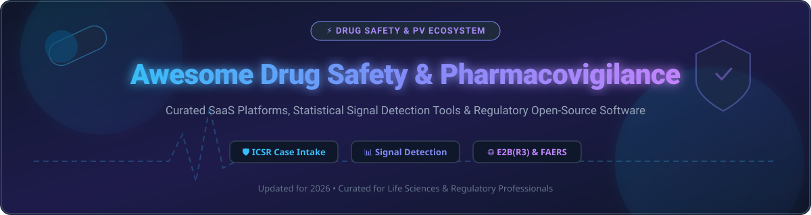

# 💊 Awesome Drug Safety & Pharmacovigilance 🛡️

  
  
  
  
  

## 📌 Overview

Welcome to the definitive **Awesome Drug Safety & Pharmacovigilance** directory! 🚀 This repository tracks top **SaaS platforms**, enterprise software, and **open-source GitHub projects** dedicated to **Drug Safety, Pharmacovigilance (PV), Adverse Event (AE) Case Processing, Signal Detection, and Regulatory Compliance** (FDA FAERS, EMA EudraVigilance, ICH E2B(R3), MedDRA, WHODrug).

Whether you are a drug safety officer, regulatory affairs manager, clinical researcher, biostatistician, or software engineer building safety data pipelines, this curated list serves as your comprehensive reference guide.

---

## 📑 Table of Contents

- [📊 Sector Overview & Market Intelligence](#-sector-overview--market-intelligence)
- [🏢 SaaS & Hosted Enterprise Platforms](#-saas--hosted-enterprise-platforms)
- [🔓 Open-Source GitHub Projects](#-open-source-github-projects)
- [🤝 How to Contribute](#-how-to-contribute)
- [💖 Support & Sponsoring](#-support--sponsoring)
- [⚠️ Disclaimer](#%EF%B8%8F-disclaimer)
- [📈 Star History](#-star-history)

---

## 📊 Sector Overview & Market Intelligence

The global **Pharmacovigilance Software Market** is estimated at **$240 Million – $2.5 Billion+ USD** in 2026 (expanding to **$11.1 Billion+ USD** when including broader safety services and end-to-end regulatory compliance intelligence), operating at a compound annual growth rate (CAGR) of **7.5% – 10.5%**. 

📈 **Market Structure**: The market is **moderately fragmented**, undergoing rapid technology-driven consolidation. While enterprise incumbents dominate high-volume regulatory submission gateways and validated database systems, emerging cloud-native and AI-driven platforms are capturing significant market share in automated ICSR intake and statistical signal detection.

---

## 🏢 SaaS & Hosted Enterprise Platforms

The table below details enterprise SaaS solutions ranked by **Company Size / Valuation / Annual Revenue** (descending):

| Platform | Company | Enterprise Valuation / Revenue (Market Size) | Specific Starting Pricing Tier | Free Tier / Trial Limit | Key Focus & Regulatory Capabilities |
| :--- | :--- | :---: | :--- | :--- | :--- |
| **[Oracle Argus Safety](https://www.oracle.com/life-sciences/safety-solutions/)** 🏛️ | Oracle Corporation | **$380B+ Valuation** ($53B+ Annual Rev) | **$10,000 / month** ($120,000/yr base cloud suite) | ❌ **No Free Trial** (Guided enterprise demo on request) | Gold-standard ICSR case processing, Argus Affiliate, Argus Interchange, E2B(R3) reporting. |
| **[SAP Pharmacovigilance](https://www.sap.com/)** 💼 | SAP SE | **$250B+ Valuation** ($35B+ Annual Rev) | **$8,500 / month** ($102,000/yr enterprise core) | ❌ **No Free Trial** (30-day SAP Cloud trial env available for developers) | Enterprise life sciences safety database integrated with SAP ERP and clinical suites. |
| **[Sparta Systems (TrackWise)](https://www.spartasystems.com/)** 🛡️ | Honeywell International | **$130B+ Parent Valuation** ($38B+ Annual Rev) | **$5,000 / month** ($60,000/yr starting suite) | ❌ **No Free Trial** (14-day sandboxed demo environment upon request) | TrackWise Quality Management System (QMS), complaints, CAPA, and eMDR/E2B adverse event reporting. |
| **[Veeva Vault Safety](https://www.veeva.com/)** ⚡ | Veeva Systems | **$35B+ Valuation** ($2.4B+ Annual Rev) | **$4,166 / month** ($50,000/yr minimum commitment) | ❌ **No Free Trial** (Custom interactive demo available for sponsors/CROs) | Cloud-native ICSR processing, automated MedDRA/WHODrug updates, multi-tenant safety database. |
| **[IQVIA Vigilance](https://www.iqvia.com/)** 📊 | IQVIA Holdings | **$42B+ Valuation** ($15B+ Annual Rev) | **$4,000 / month** ($48,000/yr base tier) | ❌ **No Free Trial** (Proof-of-Concept pilot access for clinical trials) | AI-driven adverse event case management, signal analysis, global regulatory reporting. |
| **[ArisGlobal LifeSphere Safety](https://www.arisglobal.com/)** 🧠 | ArisGlobal (Nordic Capital) | **$1.5B+ Valuation** ($200M+ Annual Rev) | **$3,500 / month** ($42,000/yr starter package) | ❌ **No Free Trial** (30-day proof-of-concept sandbox upon request) | LifeSphere MultiVigilance, NavaX AI automated intake, multilingual field reporting. |
| **[EXTEDO (SafetyEasy)](https://www.extedo.com/)** 🌐 | EXTEDO GmbH | **$100M+ Valuation** ($30M+ Annual Rev) | **$1,500 / month** ($18,000/yr entry tier) | ❌ **No Free Trial** (14-day guided trial for safety teams) | Regulatory Information Management (RIM) + SafetyEasy E2B(R3) submission gateway. |
| **[Ennov Vigilance](https://www.ennov.com/)** 📑 | Ennov Group | **$80M+ Valuation** ($25M+ Annual Rev) | **$1,200 / month** ($14,400/yr starting plan) | ❌ **No Free Trial** (Demonstration sandbox access on demand) | Unified compliance suite, intuitive role-based adverse event logging & reduced-click triage. |
| **[Celegence](https://www.celegence.com/)** 🔬 | Celegence LLC | **$40M+ Valuation** ($12M+ Annual Rev) | **$1,000 / month** ($12,000/yr starting project rate) | ❌ **No Free Trial** (Consultative trial assessment) | Regulatory & PV tech solutions, automated safety writing, and case management services. |
| **[AB Cube (SafetyEasy Suite)](https://www.abcube.com/)** 📦 | AB Cube | **$25M+ Valuation** ($8M+ Annual Rev) | **$800 / month** ($9,600/yr starter plan) | ❌ **No Free Trial** (7-day trial environment for qualified CROs) | SaaS safety database, multivigilance case handling, electronic reporting for pharma & biotech. |

---

## 🔓 Open-Source GitHub Projects

The following active open-source tools provide R libraries, Python packages, and web applications for pharmacovigilance data ingestion, disproportionality analysis, and E2B standards. Repositories are sorted by **GitHub Star Count** (descending).

| Repository / Project | Language / Tech | Stars | Description & Features |
| :--- | :---: | :---: | :--- |
| **[WangLabCSU/faers](https://github.com/WangLabCSU/faers)** 🧪 | R / Bioconductor |  | **High-fidelity R interface for FDA FAERS**. Standardized adverse event surveillance, data deduplication, and terminology mapping. |
| **[bips-hb/pvm](https://github.com/bips-hb/pvm)** 📈 | R / C++ |  | **Pharmacovigilance Methods Package**. Implements disproportionality analysis algorithms (PRR, ROR, BCPNN, MGPS) for signal detection. |
| **[MSH/OpenRIMS-PV](https://github.com/MSH/OpenRIMS-PV)** 🌐 | PHP / JavaScript |  | **Active Monitoring for Medicine Safety**. FOSS application created under USAID MTaPS project for National Medicines Regulatory Authorities. |
| **[niuniular/MDDC](https://github.com/niuniular/MDDC)** 🔬 | R / CRAN |  | **Modified Detecting Deviating Cells algorithm**. Statistical signal detection for drug-event pairs and pharmacovigilance simulation. |
| **[YihaoTancn/pvEBayes](https://github.com/YihaoTancn/pvEBayes)** 🧮 | R / CRAN |  | **Empirical Bayes methods for PV**. Implements Gamma-Poisson Shrinker (GPS), K-gamma, Koenker-Mizera (KM), and general-gamma models via CVXR. |
| **[MSH/PViMS-2](https://github.com/MSH/PViMS-2)** 🏥 | Java / Web |  | **PharmacoVigilance Monitoring System 2**. Web-based active safety surveillance application for public health programs. |
| **[bips-hb/srsim](https://github.com/bips-hb/srsim)** 🎲 | R |  | **Spontaneous Reporting Simulator**. Simulates adverse event reporting databases for testing signal detection methodologies. |
| **[E2B4Free](https://github.com/ishandutta2007/Awesome-Awesome-Awesome)** 📄 | Open-Source Web |  | **E2B(R3) Adverse Event Reporting App**. Open-source case management application supporting MedDRA, EDQM, UCUM, and CIOMS export. |

### 🛠️ Additional Open-Source Frameworks & Libraries

- **[openEBGM](https://cran.r-project.org/package=openEBGM)** 📊 — R implementation of the Gamma-Poisson Shrinker (GPS) and Empirical Bayes Geometric Mean (EBGM) disproportionality scores.
- **[deconvolveR](https://cran.r-project.org/package=deconvolveR)** 🧮 — Empirical Bayes deconvolution for signal estimation across large-scale biomedical databases.
- **[kidsides](https://github.com/tatonetti-lab/kidsides)** 👶 — Specialized pediatric drug safety signal database and analytics pipeline.
- **[BiDEX](https://github.com/ biomedical-adverse-event-extraction)** 🔍 — Biomedical adverse event extraction framework utilizing NLP for electronic health records.
- **[rankv](https://github.com/rankv-pv)** 💉 — Rank-aggregated signal detection tool optimized for VAERS (Vaccine Adverse Event Reporting System) data.
- **[E2B / FreeVigilance](https://github.com/ishandutta2007/Awesome-Awesome-Awesome)** 📜 — JavaScript parser and validator for ICH E2B(R3) XML safety payloads.

---

## 🤝 How to Contribute

Contributions are highly appreciated! Help keep this pharmacovigilance directory up to date:

1. **Fork** this repository. 🍴
2. Edit `README.md` with factual, verifiable information. ✏️
3. Ensure entries adhere to the table structure (including pricing, company size, and star badges). 📋
4. Submit a **Pull Request** with a descriptive summary of your changes. 🚀

---

## 💖 Support & Sponsoring

If you find this repository valuable for your research, clinical operations, or pharmacovigilance engineering projects, please consider supporting the project:

- ⭐ **Star this repository** to improve visibility for the drug safety community.
- 📢 **Share it** with colleagues, biostatisticians, and regulatory affairs professionals.
- ☕ **Buy me a coffee / Sponsor**: If you'd like to support ongoing maintenance and research, consider sponsoring via [GitHub Sponsors](https://github.com/sponsors/ishandutta2007)!

---

## ⚠️ Disclaimer

- This list is **community-curated** for educational and informational purposes only.
- Validation and compliance with regulatory standards (e.g., FDA 21 CFR Part 11, EU GVP Module VI, ICH E2B(R3)) are the sole responsibility of implementing organizations.
- Medical dictionary licenses (MedDRA, WHODrug) must be acquired independently from their respective governing bodies (MSSO, UMC).

---

## 📈 Star History

---

  Made with ❤️ for Pharmacovigilance & Drug Safety Professionals Worldwide.

